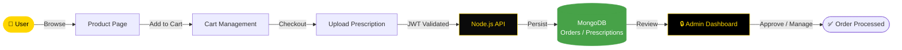

<div align="center">


[](https://git.io/typing-svg)

<br/>

<p align="center">
  <a href="https://github.com/NietoDeveloper">
    
  </a>
  <a href="https://committers.top/colombia#NietoDeveloper">
    
  </a>
  <a href="https://react.dev/">
    
  </a>
  <a href="https://nodejs.org/">
    
  </a>
  <a href="https://www.mongodb.com/">
    
  </a>
  <a href="https://www.docker.com/">
    
  </a>
  <a href="https://opensource.org/licenses/MIT">
    
  </a>
</p>

<p align="center">
  <a href="https://github.com/NietoDeveloper/Pharmacy">
    
  </a>
</p>

</div>

---

## 📋 Overview

The **Online Pharmacy Web App** enables users to digitally explore and buy medications. Developed using the **MERN stack** (MongoDB, Express.js, React, Node.js) and **Docker** for containerization, it ensures a smooth user experience for account management, order placement, and support communication. Admins handle product, prescription, and message oversight, with access secured by a unique admin passphrase.

---

## 🔄 Order & Prescription Flow



---

## 🔑 Features

### 👤 User

- **Login & Signup:** Secure user authentication.
- **Home:** Product information is accessible even without signup.
- **🛒 Product Page:** Each medicine has a dedicated page with details such as name, description, price, and available stock.
- **🛍️ Cart Management:** Users can add, edit, or delete products in their cart.
- **📞 Contact Us:** A messaging system for user inquiries.
- **📝 Checkout:** A page for uploading prescriptions.
- **🚪 Logout:** End the session securely.

### 🔒 Admin

- **Admin Authentication:** Secure login through an admin passphrase.
- **📊 Dashboard:** Manage products (add, edit, delete).
- **📩 Message Management:** Access messages from users.
- **🧾 Prescription Management:** Review uploaded prescriptions during checkout.
- **🚪 Logout:** End the session securely.

---

## 🛠️ Technologies Used

<div align="center">

| Layer | Technologies |
|:------|:-------------|
| 🎨 **Frontend** | React.js |
| ⚙️ **Backend** | Node.js, Express.js |
| 🗄️ **Database** | MongoDB |
| 🐳 **Containerization** | Docker |

</div>

---

## 🧰 Other Tools

- **Multer:** Handles prescription uploads.
- **JWT (JSON Web Tokens):** Secures user authentication and manages sessions.

---

## 🚀 Getting Started

**Step 1 — Clone the repository**

```bash
git clone https://github.com/NietoDeveloper/Pharmacy
```

**Step 2 — Docker setup**

```bash
docker-compose up --build
```

**Step 3 — Access the application**

Once the containers are up, visit `localhost:3001` to access the app.

---

## 👨‍💻 Author

**Manuel Nieto (NietoDeveloper)**

---

## 📄 License

This project is licensed under the **MIT License**.

<div align="center">

<br/>


</div>
