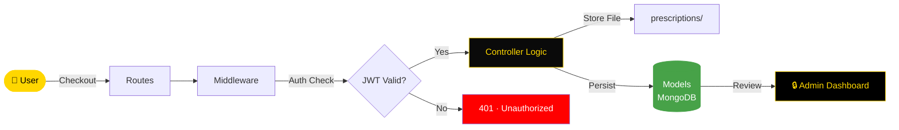

<div align="center">


[](https://git.io/typing-svg)

<br/>

<p align="center">
  <a href="https://nodejs.org/">
    
  </a>
  <a href="https://expressjs.com/">
    
  </a>
  <a href="https://www.mongodb.com/">
    
  </a>
  <a href="https://www.docker.com/">
    
  </a>
  <a href="https://opensource.org/licenses/MIT">
    
  </a>
</p>

<p align="center">
  <a href="https://github.com/NietoDeveloper/Pharmacy/tree/main/server">
    
  </a>
</p>

</div>

---

## 📋 Overview

The **server** for the Pharmacy application. Built with **Node.js**, it exposes a RESTful API handling product, order, and user management, secured with JWT authentication and an admin passphrase, with dedicated support for prescription uploads.

---

## 🗂️ Project Structure

```text
server/
├── middleware/       # Auth guards, request validation, error handling
├── models/            # Database schemas (products, users, orders)
├── prescriptions/       # Uploaded prescription storage
└── routes/               # RESTful API endpoint definitions
```

---

## 🔄 Prescription & Order Flow



---

## ⚙️ Core Modules

- **Middleware:** Handles authentication guards, request validation, and error handling.
- **Models:** Define data structures for products, users, and orders.
- **Prescriptions:** Storage for prescription files uploaded during checkout.
- **Routes:** Expose RESTful endpoints consumed by the Pharmacy UI.

---

## 🛠️ Technologies

<div align="center">

| Layer | Technologies |
|:------|:-------------|
| 🏃 **Runtime** | Node.js |
| ⚙️ **Framework** | Express.js |
| 🗄️ **Database** | MongoDB |
| 🐳 **Containerization** | Docker |

</div>

---

## 🧰 Other Tools

- **Multer:** Handles prescription file uploads.
- **JWT (JSON Web Tokens):** Secures user authentication and manages sessions.

---

## 🚀 Getting Started

**Step 1 — Clone the repository**

```bash
git clone https://github.com/NietoDeveloper/Pharmacy
```

**Step 2 — Navigate to the server directory**

```bash
cd server
```

**Step 3 — Install dependencies**

```bash
npm install
```

**Step 4 — Configure environment variables**

Create a `.env` file with your MongoDB connection string, JWT secret, and admin passphrase.

**Step 5 — Start the server**

```bash
npm start
```

**Step 6 — (Optional) Run with Docker**

```bash
docker-compose up --build
```

Once the containers are up, the API is available at `localhost:3001` (or as configured).

---

## 👨‍💻 Author

**Manuel Nieto (NietoDeveloper)**

---

## 📄 License

This project is licensed under the **MIT License**.

<div align="center">

<br/>


</div>


<div align="center">


[](https://git.io/typing-svg)

<br/>

<p align="center">
  <a href="https://nodejs.org/">
    
  </a>
  <a href="https://expressjs.com/">
    
  </a>
  <a href="https://www.mongodb.com/">
    
  </a>
  <a href="https://www.docker.com/">
    
  </a>
  <a href="https://opensource.org/licenses/MIT">
    
  </a>
</p>

<p align="center">
  <a href="https://github.com/NietoDeveloper/Pharmacy/tree/main/server">
    
  </a>
</p>

</div>

---

## 📋 Overview

The **server** for the Pharmacy application. Built with **Node.js**, it exposes a RESTful API handling product, order, and user management, secured with JWT authentication and an admin passphrase, with dedicated support for prescription uploads.

---

## 🗂️ Project Structure

```text
server/
├── middleware/       # Auth guards, request validation, error handling
├── models/            # Database schemas (products, users, orders)
├── prescriptions/       # Uploaded prescription storage
└── routes/               # RESTful API endpoint definitions
```

---

## 🔄 Prescription & Order Flow


---

## ⚙️ Core Modules

- **Middleware:** Handles authentication guards, request validation, and error handling.
- **Models:** Define data structures for products, users, and orders.
- **Prescriptions:** Storage for prescription files uploaded during checkout.
- **Routes:** Expose RESTful endpoints consumed by the 