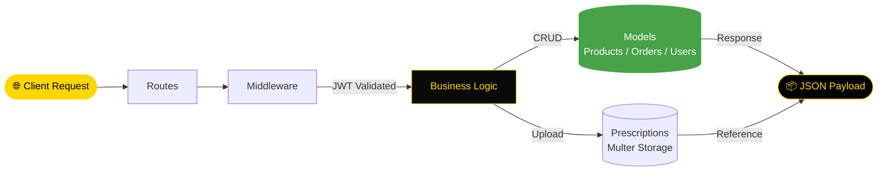

<div align="center">


[](https://git.io/typing-svg)

<br/>

<p align="center">
  <a href="https://nodejs.org/">
    
  </a>
  <a href="https://expressjs.com/">
    
  </a>
  <a href="https://www.mongodb.com/">
    
  </a>
  <a href="https://www.docker.com/">
    
  </a>
  <a href="https://opensource.org/licenses/MIT">
    
  </a>
</p>

<p align="center">
  <a href="https://github.com/NietoDeveloper/Pharmacy/tree/main/server">
    
  </a>
</p>

</div>

---

## 📋 Overview

The **server** for the **Pharmacy** application. Built with **Node.js** and **Express.js**, it exposes RESTful endpoints for user authentication, product management, cart and order processing, and prescription file handling, backed by **MongoDB** and secured with **JWT** authentication and an admin passphrase.

---

## 🗂️ Project Structure

```text
server/
├── middleware/       # JWT auth guards and request validation
├── models/            # Mongoose schemas (Users, Products, Orders, Messages)
├── prescriptions/       # Uploaded prescription files (Multer storage)
└── routes/               # RESTful API endpoint definitions
```

---

## 🔄 Order & Prescription Flow



---

## ⚙️ Core Modules

- **Middleware:** JWT authentication guards and request validation, including admin passphrase checks.
- **Models:** Mongoose schemas for users, products, orders, and messages.
- **Prescriptions:** Storage for prescription files uploaded during checkout.
- **Routes:** RESTful endpoints consumed by the client and admin dashboard.

---

## 🛠️ Technologies

<div align="center">

| Layer | Technologies |
|:------|:-------------|
| 🏃 **Runtime** | Node.js |
| ⚙️ **Framework** | Express.js |
| 🗄️ **Database** | MongoDB |
| 🔐 **Auth** | JWT (JSON Web Tokens), Admin Passphrase |
| 📤 **File Uploads** | Multer |
| 🐳 **Containerization** | Docker |

</div>

---

## 🚀 Getting Started

### Prerequisites

- Node.js (v16 or higher)
- Docker (optional, for containerized setup)

### Installation & Execution

**Step 1 — Clone the repository**

```bash
git clone https://github.com/NietoDeveloper/Pharmacy
```

**Step 2 — Navigate to the server directory**

```bash
cd server
```

**Step 3 — Install dependencies**

```bash
npm install
```

**Step 4 — Configure environment variables**

Create a `.env` file in the `server` directory with your MongoDB connection string, JWT secret, and admin passphrase.

**Step 5 — Start the server**

```bash
npm start
```

**Step 6 — (Optional) Run with Docker**

```bash
docker-compose up --build
```

Once the containers are up, the API is accessible on its configured port.

---

## 👨‍💻 Author

**Manuel Nieto (NietoDeveloper)**

---

## 📄 License

This project is licensed under the **MIT License**.

<div align="center">

<br/>


</div>
