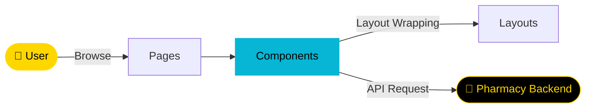

<div align="center">


[](https://git.io/typing-svg)

<br/>

<p align="center">
  <a href="https://react.dev/">
    
  </a>
  <a href="https://nodejs.org/">
    
  </a>
  <a href="https://vitejs.dev/">
    
  </a>
  <a href="https://tailwindcss.com/">
    
  </a>
  <a href="https://www.docker.com/">
    
  </a>
  <a href="https://opensource.org/licenses/MIT">
    
  </a>
</p>

<p align="center">
  <a href="https://github.com/NietoDeveloper/Pharmacy/tree/main/ui">
    
  </a>
</p>

</div>

---

## 📋 Overview

**Pharmacy UI** is the frontend of an application for managing pharmacy services. It provides a modern, responsive interface for users to interact with pharmacy-related features.

---

## 🗂️ Project Structure

```text
ui/
├── public/
└── src/
    ├── assets/
    │   └── images/
    ├── components/    # Reusable UI components
    ├── layouts/        # Page layout wrappers
    └── pages/           # Page-level components
```

---

## 🔄 UI Data Flow



---

## 🛠️ Technologies

<div align="center">

| Technology | Role |
|:-----------|:-----|
| **Node.js** | Runtime environment |
| **React** | Frontend library for dynamic UI |
| **Vite** | Fast build tool for development |
| **Tailwind CSS** | Utility-first CSS framework |
| **Docker** | Containerization for consistent deployment |

</div>

---

## ✨ Features

- **Responsive and Intuitive User Interface:** Clean, mobile-friendly design.
- **Product Browsing and Selection:** Structured pharmacy product exploration.
- **Clean Design:** Styled entirely with Tailwind CSS.
- **Containerized Setup:** Easy, consistent deployment via Docker.

---

## 🚀 Installation

**Step 1 — Clone the repository**

```bash
git clone https://github.com/NietoDeveloper/Pharmacy
```

**Step 2 — Navigate to the project directory**

```bash
cd pharmacy-ui
```

**Step 3 — Install dependencies**

```bash
npm install
```

**Step 4 — Start the development server**

```bash
npm run dev
```

**Step 5 — (Optional) Build and run with Docker**

```bash
docker build -t pharmacy-ui .
docker run -p 5173:5173 pharmacy-ui
```

---

## 📖 Usage

- Access the app at `http://localhost:5173`.
- Browse pharmacy products and interact with the UI.
- Use Docker for consistent deployment across environments.

---

## 🤝 Contributing

Contributions are welcome! Fork the repository and submit a pull request.

---

## 👨‍💻 Author

Created by **Manuel Nieto (NietoSoftwareDeveloper)**.

<div align="center">

<br/>


</div>
